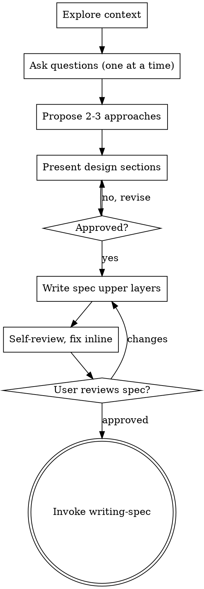

# Brainstorming Ideas Into Designs

Turn ideas into fully formed designs through natural, collaborative dialogue. Understand the project, ask questions one at a time, then present a design and get approval.

<HARD-GATE>
Do NOT write code, scaffold, invoke an implementation skill, or take any implementation action until you have presented a design and your human partner has approved it. EVERY project, regardless of how simple it looks.
</HARD-GATE>

## "This is too simple to need a design"

Every project goes through this - a todo list, a one-function utility, a config change. "Simple" is where unexamined assumptions cause the most wasted work. The design can be three sentences, but you must present it and get approval.

## Checklist

Create a todo per item; complete in order:

1. **Explore context** - files, docs, recent commits.
2. **Ask clarifying questions** - one at a time; multiple-choice when you can. Purpose, constraints, success criteria.
3. **Propose 2-3 approaches** - trade-offs, lead with your recommendation.
4. **Present the design in sections** - scaled to complexity; get approval after each.
5. **Write the spec's upper layers** - to `docs/specs/YYYY-MM-DD-<topic>.md`, then commit.
6. **Self-review** - placeholders, contradictions, scope, ambiguity. Fix inline.
7. **User reviews the spec** - wait for approval.
8. **Hand off to writing-spec** - to add tasks and verification.

## Process

**The terminal state is invoking writing-spec.** It is the only skill you invoke after brainstorming.

## Understanding the idea

- Look at the current state first (files, docs, commits).
- Assess scope early. If the request is really several independent subsystems, say so and help decompose into sub-projects before refining details. Each sub-project gets its own spec → build cycle.
- For a well-scoped project, ask one question at a time. Multiple-choice is easier to answer than open-ended. Focus on purpose, constraints, success criteria.

## Exploring approaches

Propose 2-3 approaches with trade-offs. Lead with the one you recommend and say why.

## Presenting the design

Present in sections scaled to their complexity - a few sentences when straightforward, more when nuanced. After each section, check it is right. Cover architecture, components, data flow, error handling, testing. Go back and clarify when something does not fit.

## Design for clarity

Break the system into units with one clear purpose, well-defined interfaces, understandable and testable on their own. For each unit: what does it do, how do you use it, what does it depend on? If you cannot change a unit's internals without breaking its consumers, the boundary needs work. Smaller, focused files are easier to reason about and edit reliably.

## In existing codebases

Explore the structure and follow existing patterns before proposing changes. Where existing code genuinely blocks the work - a file grown too large, tangled responsibilities - fold a targeted improvement into the design, the way a good developer improves code they touch. Do not propose unrelated refactoring.

## After approval

- Write the design's upper layers (summary, acceptance criteria, scope, design notes, open questions) to `docs/specs/YYYY-MM-DD-<topic>.md` using the format in `writing-spec`'s `spec-template.md`. Commit it.
- Self-review with fresh eyes: any unfinished stub, contradiction, scope creep, or requirement that reads two ways? Fix inline.
- Ask your human partner to review the written spec. Wait. If they want changes, make them and re-review.
- Then invoke **writing-spec** to add the Tasks and End-to-end verification layers. Do not invoke any other skill.

## Principles

- One question at a time.
- Multiple-choice preferred.
- YAGNI - cut unnecessary features from every design.
- Always explore 2-3 alternatives before settling.
- Present, get approval, then move on.
- Stay flexible - go back when something does not make sense.
